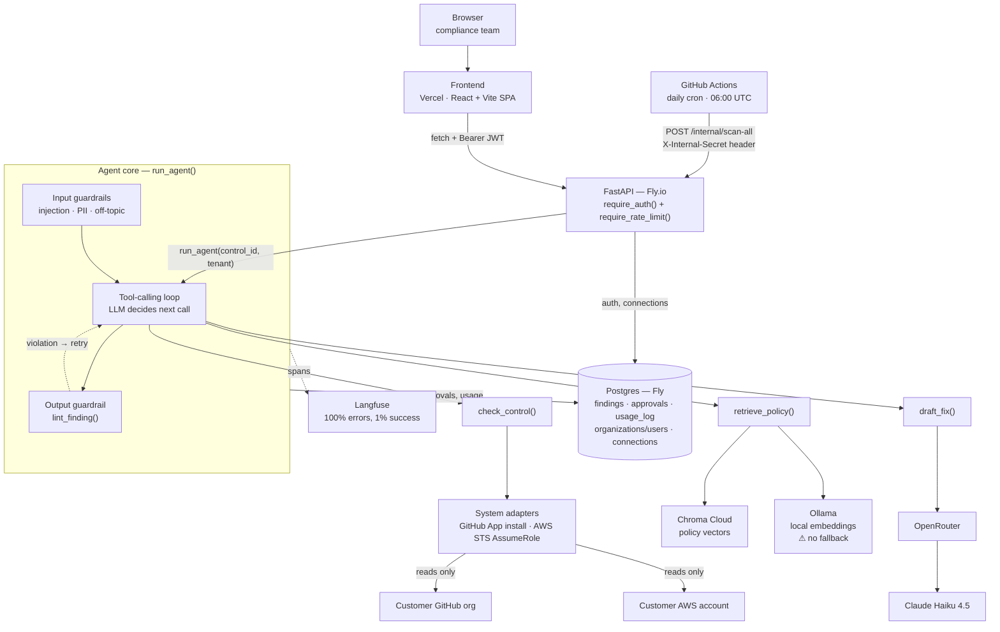

# Compliance Copilot — Architecture

How one compliance check moves through the system. Two entry points — a person in the
dashboard, or a daily cron sweep — feed the same agent loop. The loop's tool calls are the
only thing that ever leaves this system: read-only calls into a tenant's own AWS or GitHub
account, never writes back.

**Read-only boundary.** `check_control` is the only tool that reaches a tenant's own
infrastructure, and it only ever reads: IAM/S3/CloudTrail via an assumed AWS role, branch
protection/2FA/Dependabot via a GitHub App install. Nothing in this system writes back to a
customer's account.

**Single point of failure.** `retrieve_policy` depends on one local Ollama instance for
embeddings, with no fallback. If it's down, retrieval silently returns zero hits instead of
erroring — the agent either drafts an ungrounded fix or gives up, rather than failing loud.

**Retry, not a second agent.** Every finding an agent tries to submit passes through
`lint_finding()` first. A rejected finding (missing evidence, an uncited claim, legal-advice
language, an unfaithful fix) goes back into the same tool-calling loop as a retry — there's one
agent, not a reviewer agent checking a writer agent.

**Two entry points, one loop.** A browser request and the daily cron sweep both end at
`run_agent()` with no branching in between — nothing about the agent's behavior changes based
on which one triggered it.
