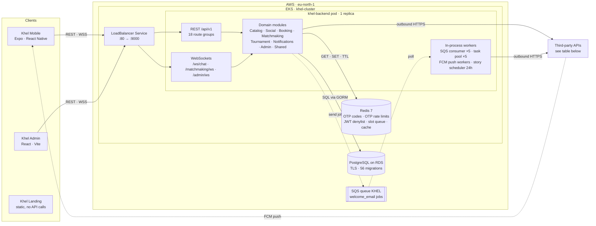
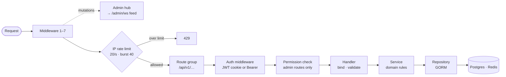
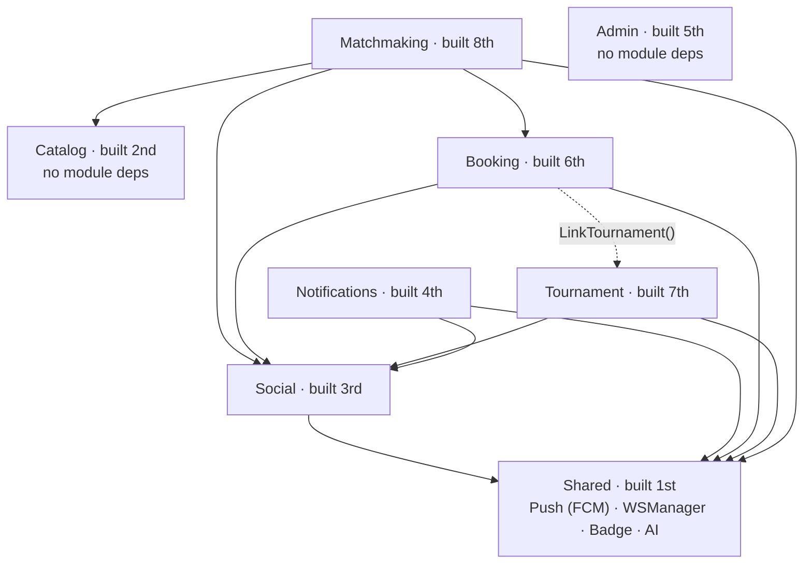
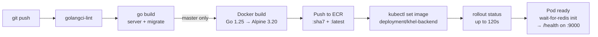

# Khel Architecture

How the mobile app, admin panel and landing site reach the Go backend on AWS EKS, and what that backend depends on. Drawn from `Khel-Backend`, `Khel-Mobile`, `Khel-Admin`, `Khel-Landing` and `Khel-backend-k8` as of 29 September 2026.

**At a glance:** 18 REST route groups · 3 WebSocket endpoints · 8 domain modules · 56 SQL migrations · 9 third-party APIs · 1 backend replica

## Repositories

| Repo | What it is | Stack |
|---|---|---|
| `Khel-Mobile` | Player + turf-owner app | Expo, React Native, React Query, Zod, Firebase Messaging, EAS builds |
| `Khel-Admin` | Internal admin panel | React 18, Vite, Radix UI, Tailwind, React Query, Recharts |
| `Khel-Landing` | Marketing site (static, no API calls) | React, Three.js, Framer Motion |
| `Khel-Backend` | API, WebSockets, background workers | Go 1.25, Gin, GORM, golang-migrate, gorilla/websocket |
| `Khel-backend-k8` | Kubernetes manifests | Deployment, LoadBalancer Service, Redis Deployment + PVC, ConfigMap, Secret |

## System map

Solid arrows are request/response; dashed arrows are asynchronous. Everything runs through one Gin process. Redis runs inside the cluster next to it, while RDS and SQS are managed AWS services outside it. The only thing that reaches a phone without going through the API is FCM push.

### Third-party APIs

| Service | Used for | Called from |
|---|---|---|
| Firebase Cloud Messaging | Push notifications | `services/shared/fcm.go`, `push.go` |
| Anthropic API | AI match recaps | `services/shared/ai.go` |
| PayFast | Checkout + signed webhook (`POST /api/v1/payments/payfast/webhook`) | `services/booking/payment_gateway.go` |
| Stripe | Payment intents | `services/booking/service.go` |
| Supabase Storage or Cloudinary | Image + video uploads (Supabase when `SUPABASE_*` is set, else Cloudinary) | `helpers/uploadImages.go` |
| LocationIQ | Place search, reverse geocoding | `handlers/location_handler.go`, `helpers/geocoding.go` |
| OpenWeather | Match-day forecast | `services/social/weather.go` |
| Facebook Graph | OAuth sign-in | `oauth/facebook.go` |
| Gmail SMTP | OTP + welcome emails | `helpers/send_email.go`, `queue/mail.go` |

## One request, start to finish

Global middleware runs on every request in this order (`BuildRouter` in `internal/app/middleware.go`):

| # | Middleware | What it does |
|---|---|---|
| 1 | Recovery | Turns a panic into a 500 |
| 2 | Request ID | Tags every log line for the request |
| 3 | Request log | Logs method, path, latency |
| 4 | Error handler | Renders `APIError`s as JSON |
| 5 | Audit logger | Writes mutating `/api/v1` requests to the DB and broadcasts them to the admin feed |
| 6 | CORS | Origin allowlist from `ALLOWED_ORIGINS` |
| 7 | Security headers | HSTS (production), CSP, `X-Frame-Options: DENY`, nosniff |
| 8 | IP rate limit | 20 req/s per IP, burst 40, else 429 |

The audit logger calls `c.Next()` before recording, and it sits before CORS and the rate limiter, so it also records requests those two reject, with their final status code.

## How the modules are wired

`modules.WireAll` (`internal/app/modules/all.go`) builds the eight domain modules in a fixed order and hands each one references to the modules it needs. An arrow points from a module to one it holds.

The dotted arrow is `booking.LinkTournament(...)`: Booking is built before Tournament, so it gets that reference in a second step.

## Shipping the backend

From `Jenkinsfile`, `Dockerfile` and `Khel-backend-k8/deployment.yaml`:

Lint and compile run on every branch; only `master` builds the image and deploys. The mobile app ships separately through EAS. Nothing in these repos says where Khel Admin and Khel Landing are hosted.

## What the diagrams point to

- **All realtime state lives in one pod.** The chat hub, the matchmaking socket manager, the admin feed hub and the per-IP rate limiter are Go maps in process memory. A second replica would put users on different pods that can't see each other's sockets. Redis is already deployed, so Redis pub/sub is the natural fan-out when you need to scale out.
- **Redis is on the sign-in path.** OTP codes, OTP rate limits, the JWT denylist and slot-queue state all sit in one in-cluster Redis pod. New backend pods wait for it before starting. If it restarts, OTP sign-in and slot holds stop working until it's back.
- **Migrations are a manual step.** Jenkins compiles `cmd/migrate` but never runs it. Before a rollout that depends on a schema change, run `make migrate-up` against RDS, or the new pod will query columns that don't exist yet.
- **Production config still has placeholders.** `configmap.yaml` sets `ALLOWED_ORIGINS` to `https://your-frontend-domain.com` and `COOKIE_DOMAIN` to `your-domain.com`. The admin panel runs in a browser, so its requests will fail CORS until these hold real domains. The native mobile app sends no Origin header and isn't affected.
